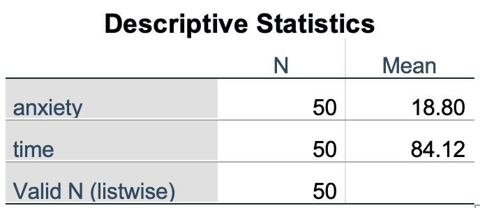

```{r setup, include = TRUE}
library (tidyverse)
library (nycflights13)
```
##### ^Create a new document and load these libraries^

## Agenda
### Last Week 

* Introduction to R Studio
* Workflow for handling data
* Data visualizations
* Bit o' Basics

---

### This Week 

* Practice Data Transformations - _Get Our Hands Dirty_
  * Bit More o' Basics
  * Review dplyr manipulation functions  
  * _(optional)_ Make pairs 
  * Tackle exercises
  
---

## Coding Basics

Just take a quick moment to review some basic operators and the syntax for assinging values and calling functions. You don't have to memorize these right now. Use the information below as a reference and they'll become second nature with practice. 

### Operators & Assignment

[Here is a great quick reference for operators and assignment!](https://www.datamentor.io/r-programming/operator/)

_I don't think I'll copy everything into this document, because when the time comes that you need these tables...it'll be faster to just Google it!_

In fact, [let me Google that for you!](https://lmgtfy.com/?q=table+of+R+operators)

### Variable Assignment

You will always want to store this or that data into a variable for quick and easy referencing. You may often want to assign longer names to shorter variabls for convenience. 

### The Basic Assignment Example
```{r}
answer <- 42
43 -> answer
```
##### **_You Do It!_**

### The Real Example
The dataset with which we're working is nycflights13::flights. It's a dataset avaliable within the package we called earlier: _nycflights13_
```{r}
"MessyFile_name-date_revision.csv$variable"
```

Sure, this example is easily called by typing "flights" as we see above. But there are times when you import a file that has an awkward filename that would be troulbesome to type again and again. More characters means more chance of errors. You want your variable names to clearly identify what you're referencing, but also simple enough to type without error. For example: 

```{r}
f <- nycflights13::flights
f 
summary(f)
```

##### *However, what could be problematic with this assignment?*

### Functions

Later we'll learn to write our own functions. For now, R has plenty of functions already built for our use. Today we'll just cover how functions are structured and how we call them. 

### For example: 

> function_name(arg1 = val1, arg2 = val2, ...)

The example I used above [summary(f)] to generate descriptive statistics of the _flights_ dataset is a great example.

Well, kind of... Some arguments are just entered as a parameter and others require a value. Often times, the dataset is the first argument and there is not arg = val. Some functions do require a value be assigned to the arugment. 

_The first function I learned in R was:_

```{r}
sample(1:10, replace = TRUE)
```

## Data Transformations


Being able to grasp and manipulate the data in our possesion is the key to doing anything. If you can't transform the data you have, then you're limited to what you're given. Like doing surgery without being able to rearrange some organs! 

We'll be covering (briefly) the 5 + 1 _dplyr_ functions (called verbs) that are our tools for conducting statistical surgery. Here they are: 

##### _I wonder which airline has the most delays._

### 1. _select()_
Subset observations **by variable names** (i.e. columns). 
```{r}
loser <- select(flights, 
                carrier, 
                arr_delay, 
                dep_delay)
loser
```

### 2. _filter()_
Subset observations based **on their values**. 
```{r}
##Disregard for now
summarise(flights, 
           arr.mean = mean(arr_delay, na.rm = TRUE),
           dep.mean = mean(dep_delay, na.rm = TRUE))

## Pay attention here
losertimes <- filter(loser,
                     arr_delay > 7,
                     dep_delay > 13)
losertimes
```

##### Now you try!
##### Go to Exercise 1

### 3. _arrange()_
Reorders observations within one or more columns.
```{r}
losertimessorted <- arrange(losertimes, 
                            desc(arr_delay, #sort first by...
                                 dep_delay)) #sort second by...
losertimessorted
```

### 4. _mutate()_
Create new variables based on exsiting ones.
```{r}
## arr_delay is in minutes. What is it in hours? 
mutate(losertimessorted, 
       "arr_delay (hours)" = arr_delay / 60)
```

##### Now you try!
##### Go to Exercise 2

#### Pipe Break
Through the last four verbs, I've broken the code up throughout. That means I now have three variables holding similar values. **How can I make this more efficient?**

```{r}
select(flights, carrier, arr_delay, dep_delay) %>%
  filter(arr_delay > 7, dep_delay > 13) %>%
  arrange(desc(arr_delay, dep_delay))
```


### 5. _summrise()_
Create summary tables of variables. 


**A few of the helper functions you can use here:**

* n() : gives sample size
* mean() : gives mean
* sd() : gives standard deviation
* _See more with ?summarize_
```{r}
summarise(flights, 
           arr.mean = mean(arr_delay, na.rm = TRUE),
           dep.mean = mean(dep_delay, na.rm = TRUE))

?summarise
```

### +1 _group_by()_
Groups data by variable levels (male/female; high/med/low)

```{r}
flights %>%
    group_by(dest) %>%
    summarize(count = n(),
              mean_arr = mean(dep_delay, na.rm = TRUE)) %>%
    arrange(desc(mean_arr))
```


## Exercises

### Exercise 1: Filtering
Pick whichever you'd like: 

_Find all flights that..._

1. Had an arrival delay of two or more hours
2. Flew to Houston (IAH or HOU)
3. Were operated by United, American, or Delta
4. Departed in summer (July, August, and September)
5. Arrived more than two hours late, but didn’t leave late
6. Were delayed by at least an hour, but made up over 30 minutes in flight
7. Departed between midnight and 6am (inclusive)

_When you have a working example, post it to the discussion board!_

### Exercise 2: Mutate
The _distance_ variable is the distance between airports (_origin_ -> _dest_) in miles. Can you create a new variable called _distkm_ that shows the distance in kilometers?

#####

#### My Answer
```{r}
flights %>%
  mutate(distkm = flights$distance / 0.62137)
```

### Exercise X: Challenge!
Choose any of the exercise below (5.7.1 in the text) and try to come up with the most elegant solution. 
**OR** come up with your own question you'd like to answer from the _flights_ data set...and answer it! 

1. Which plane (tailnum) has the worst on-time record?
2. What time of day should you fly if you want to avoid delays as much as possible?
3. For each destination, compute the total minutes of delay. For each flight, compute the proportion of the total delay for its destination.
4. Delays are typically temporally correlated: even once the problem that caused the initial delay has been resolved, later flights are delayed to allow earlier flights to leave. Using lag(), explore how the delay of a flight is related to the delay of the immediately preceding flight.
5. Look at each destination. Can you find flights that are suspiciously fast? (i.e. flights that represent a potential data entry error). Compute the air time of a flight relative to the shortest flight to that destination. Which flights were most delayed in the air?
6. Find all destinations that are flown by at least two carriers. Use that information to rank the carriers.
7. For each plane, count the number of flights before the first delay of greater than 1 hour.


## Other Resource

[R Cheatsheets!](https://rstudio.com/resources/cheatsheets/)
